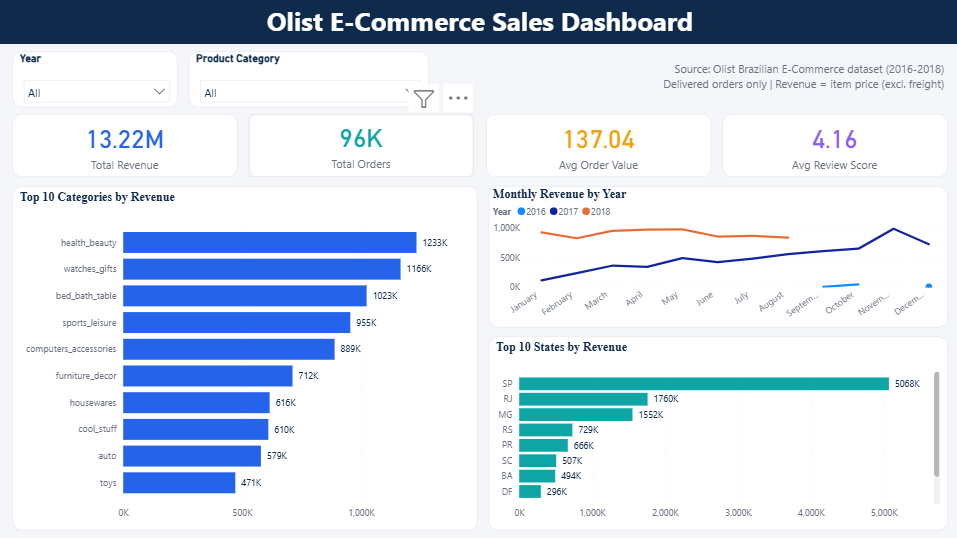

# E-Commerce Sales Analysis (SQL + Power BI)

An end-to-end sales analysis of the Olist Brazilian e-commerce dataset. Data is stored and queried in **PostgreSQL**, and the findings are presented in an interactive **Power BI** dashboard with DAX measures, KPI cards and slicers.


---

## Dashboard Preview



## Problem Statement

An online marketplace wants to understand where its revenue comes from and how it is trending. This project answers questions such as:

- How much revenue and how many orders does the business generate each month?
- Which product categories and which states drive the most revenue?
- How long do deliveries take, and how many orders arrive late?
- How satisfied are customers, and which categories get the best reviews?

## Dataset

- **Source:** [Brazilian E-Commerce Public Dataset by Olist (Kaggle)](https://www.kaggle.com/datasets/olistbr/brazilian-ecommerce)
- **Period covered:** 2016 to 2018
- **Tables used (8):** customers, orders, order_items, order_payments, order_reviews, products, sellers, product_category_translation
- **Scale:** about 100K orders and 112K order items

> The raw CSV files are not included in this repository. Download them from the Kaggle link above.

## Tools and Technologies

- **Database:** PostgreSQL (pgAdmin 4)
- **Language:** SQL (JOINs, aggregations, CTEs, window functions)
- **BI tool:** Power BI Desktop (DAX measures, slicers, KPI cards)

## Project Workflow

### 1. Database setup
Created a PostgreSQL database, defined the table schemas and imported the Olist CSV files using pgAdmin's import tool.

### 2. SQL analysis
All queries are in [`ECOM.sql`](ECOM.sql):

| # | Question | Techniques |
|---|---|---|
| Check | Row counts of every table after import | UNION ALL |
| Q1 | Monthly revenue and number of orders | JOIN, DATE_TRUNC, GROUP BY |
| Q2 | Top 10 product categories by revenue | Multi-table JOIN, LEFT JOIN for English names, COALESCE |
| Q3 | Orders and revenue by customer state | JOIN, COUNT DISTINCT |
| Q4 | Average delivery time and late deliveries | EXTRACT, CASE WHEN |
| Q5 | Average review score by category | JOIN, HAVING |
| Q6 | Top 3 categories in each state | CTE, RANK() window function |

Only orders with the status **delivered** are included, and revenue is calculated from the item `price` (freight is excluded).

### 3. Power BI dashboard
Connected Power BI to PostgreSQL and built these DAX measures:

```
Total Revenue    = SUM(order_items[price])
Total Orders     = DISTINCTCOUNT(orders[order_id])
Avg Order Value  = DIVIDE([Total Revenue], [Total Orders])
Avg Review Score = AVERAGE(order_reviews[review_score])
```

The dashboard has:
- 4 KPI cards: Total Revenue, Total Orders, Avg Order Value, Avg Review Score
- Top 10 Categories by Revenue (bar chart)
- Top 10 States by Revenue (bar chart)
- Monthly Revenue by Year (line chart, one line per year)
- Year and Product Category slicers
- A page-level filter for delivered orders

## Key Insights

All numbers below are for delivered orders across 2016-2018.

- **Overall:** the business generated about **13.22M** in revenue from roughly **96K** orders, with an average order value of about **137** and an average review score of **4.16 out of 5**.
- **Revenue is concentrated in a few states:** São Paulo (SP) alone contributes about **5.07M**, roughly **38%** of total revenue. SP, RJ and MG together account for about **63%**.
- **Top categories:** `health_beauty` (1.23M), `watches_gifts` (1.17M) and `bed_bath_table` (1.02M) lead, and together make up about **26%** of revenue.
- **Growth over time:** in 2017, monthly revenue grew steadily through the year and peaked in November. In 2018, monthly revenue stayed at a much higher level than the same months of 2017.
- **Data note:** the 2016 and 2018 lines are shorter because the dataset only contains part of those years (a few months at the end of 2016 and up to about August 2018), so a drop at the end of a line is not a real decline.

## How to Reproduce

1. Create a PostgreSQL database and the tables (column names follow the Olist CSV headers).
2. Import the CSV files into the matching tables.
3. Run the queries in `ECOM.sql`.
4. Open the `.pbix` file in Power BI Desktop, update the PostgreSQL server (host and port) and database name, and refresh the data.

## Project Structure

```
olist-sales-analysis-sql-powerbi/
├── ECOM.sql                 # All SQL queries
├── NEERAJBI_final.pbix      # Power BI dashboard
├── README.md                # Project documentation
└── images/
    └── dashboard.png        # Dashboard screenshot
```

## Limitations and Future Improvements

- Revenue uses item price only; adding freight value would show the full order value.
- Customer-level analysis such as repeat purchases and customer lifetime value is not covered yet.
- A seller performance page could be added to the dashboard.
- Date intelligence measures (month-over-month and year-over-year growth) would make trends easier to read.

## Author

**Neeraj Bhardwaj**
B.Tech (Computer Science and Engineering), J.C. Bose University of Science and Technology, YMCA

- LinkedIn: [linkedin.com/in/neeraj-bhardwaj001](https://www.linkedin.com/in/neeraj-bhardwaj001)
- GitHub: [github.com/Neeraj21439](https://github.com/Neeraj21439)
- Email: neeraj.bhardwaj.ds@gmail.com
